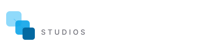
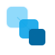

# 🎨 BRAND GUIDELINES — SYNTECH STUDIOS

> **Guide d'identité visuelle et d'utilisation du logo**
> Version 1.0.0 — Dernière mise à jour : 2025-12-15

---

## 📋 Table des Matières

1. [Identité de Marque](#identité-de-marque)
2. [Logo](#logo)
3. [Palette de Couleurs](#palette-de-couleurs)
4. [Typographie](#typographie)
5. [Iconographie](#iconographie)
6. [Applications](#applications)

---

## 🎯 Identité de Marque

### Positionnement
**SynTech Studios** est un studio technologique premium spécialisé dans :
- Solutions web & mobile sur mesure
- Systèmes d'intelligence artificielle
- Automatisation et innovation digitale

### Valeurs de Marque
- **Innovation** : Technologies de pointe, approche moderne
- **Excellence** : Qualité premium, attention aux détails
- **Fiabilité** : Solutions robustes, sécurité prioritaire
- **Accompagnement** : Écoute client, expertise conseil

### Personnalité
- Professionnelle mais accessible
- Technique mais pédagogue
- Premium mais transparente
- Innovante mais pragmatique

### Ton de Communication
- Clair et précis
- Professionnel sans être froid
- Direct et efficace
- Rassurant et expert

---

## 🏷️ Logo

### Versions Disponibles

```
assets/logo/
├── syntech-logo-full.svg       # Logo complet (gradient)
├── syntech-icon.svg            # Icon seul (gradient animé)
├── syntech-logo-white.svg      # Logo blanc (fond foncé)
├── syntech-logo-black.svg      # Logo noir (fond clair)
└── exports/                    # Exports PNG, WebP, etc.
```

### Logo Principal


**Composition** :
- **Icon** : Hexagone avec circuit interne (symbolise technologie + connexion)
- **Logotype** : "SynTech" en gradient violet→cyan
- **Baseline** : "STUDIOS" en gris espacé
- **Badge AI** : Optionnel selon contexte

**Symbolisme** :
- Hexagone = Structure, stabilité, technologie
- Circuit central = IA, intelligence, connexions
- Nodes = Réseau, collaboration, systèmes
- Gradient = Innovation, modernité, évolution

### Icon Seul


**Usage** :
- Favicon (16×16 à 512×512)
- Avatar réseaux sociaux
- App mobile icon
- Loader/spinner
- Petits espaces (< 60px)

**Animation** :
L'icon inclut une animation subtile des particules (pulsation).
Peut être désactivée si nécessaire.

---

## 📐 Construction & Proportions

### Grille de Construction

```
┌─────────────────────────────────────┐
│  [I]    SynTech                     │
│         STUDIOS                     │
└─────────────────────────────────────┘

I = Icon (rapport 1:1)
Espacement latéral : 1× largeur icon
Hauteur totale : 2× hauteur icon
```

### Dimensions Minimales

| Format | Largeur min | Hauteur min | Usage |
|--------|-------------|-------------|-------|
| Logo complet | 200px | 50px | Web, print |
| Icon seul | 32px | 32px | Favicon, UI |
| Signature email | 180px | 45px | Email |

**Règle** : Ne jamais utiliser en dessous de ces dimensions pour garantir la lisibilité.

### Zone de Sécurité

```
    ┌─────────────────────┐
    │                     │
    │  ┌─────────────┐   │
    │  │             │   │
x   │  │    LOGO     │   │ x
    │  │             │   │
    │  └─────────────┘   │
    │                     │
    └─────────────────────┘

x = 0.5× hauteur du logo
```

**Règle** : Toujours laisser un espace libre équivalent à la moitié de la hauteur du logo autour de celui-ci.

---

## 🎨 Palette de Couleurs

### Couleurs Principales

#### Gradient Signature
```css
/* Gradient principal (logo, accents) */
background: linear-gradient(135deg, #8b5cf6 0%, #06b6d4 100%);
```

**Violet Principal**
```
HEX: #8b5cf6
RGB: 139, 92, 246
HSL: 259, 89%, 66%
Pantone: 2665 C (approx)
Usage: Accents primaires, CTAs, liens
```

**Cyan Secondaire**
```
HEX: #06b6d4
RGB: 6, 182, 212
HSL: 189, 94%, 43%
Pantone: 2201 C (approx)
Usage: Accents secondaires, highlights
```

### Couleurs de Fond

**Noir Profond** (Fond principal)
```
HEX: #0a0a0f
RGB: 10, 10, 15
Usage: Background principal (dark mode)
```

**Gris Ardoise** (Fond secondaire)
```
HEX: #1a1a2e
RGB: 26, 26, 46
Usage: Cards, sections, panels
```

**Bleu Marine** (Fond tertiaire)
```
HEX: #16213e
RGB: 22, 33, 62
Usage: Hover states, overlays
```

### Couleurs de Texte

**Blanc** (Texte principal)
```
HEX: #ffffff
RGB: 255, 255, 255
Usage: Titres, texte important (dark mode)
```

**Gris Clair** (Texte secondaire)
```
HEX: #a1a1aa
RGB: 161, 161, 170
Usage: Paragraphes, descriptions
```

**Gris Moyen** (Texte tertiaire)
```
HEX: #52525b
RGB: 82, 82, 91
Usage: Labels, captions, disabled
```

### Couleurs Utilitaires

**Succès**
```
HEX: #10b981
RGB: 16, 185, 129
Usage: Confirmations, succès
```

**Alerte**
```
HEX: #f59e0b
RGB: 245, 158, 11
Usage: Warnings, attention
```

**Erreur**
```
HEX: #ef4444
RGB: 239, 68, 68
Usage: Erreurs, dangers
```

**Info**
```
HEX: #3b82f6
RGB: 59, 130, 246
Usage: Informations, tips
```

### Accessibilité

| Combinaison | Contraste | WCAG | Usage |
|-------------|-----------|------|-------|
| #ffffff sur #0a0a0f | 19.5:1 | AAA | Titres |
| #a1a1aa sur #0a0a0f | 8.4:1 | AAA | Corps de texte |
| #8b5cf6 sur #0a0a0f | 6.2:1 | AA | Liens/accents |

**Règle** : Toujours vérifier le contraste pour garantir WCAG 2.1 niveau AA minimum.

---

## ✍️ Typographie

### Fonts Principales

#### **Inter Variable** (Primary)
```css
@import url('https://fonts.googleapis.com/css2?family=Inter:wght@400;500;600;700;800&display=swap');

font-family: 'Inter', -apple-system, BlinkMacSystemFont, 'SF Pro Display', sans-serif;
```

**Usage** :
- Interface utilisateur
- Corps de texte
- Titres courants

**Weights disponibles** :
- 400 (Regular) : Texte standard
- 500 (Medium) : Labels, navigation
- 600 (Semibold) : Sous-titres
- 700 (Bold) : Titres
- 800 (Extrabold) : Hero titles

#### **Fira Code Variable** (Monospace)
```css
@import url('https://fonts.googleapis.com/css2?family=Fira+Code:wght@400;500;600&display=swap');

font-family: 'Fira Code', 'Courier New', monospace;
```

**Usage** :
- Code snippets
- Données techniques (IDs, tokens)
- URLs, emails
- Console/terminal

### Échelle Typographique

```css
/* Display (Hero) */
--text-7xl: 4.5rem;    /* 72px - Hero principal */
--text-6xl: 3.75rem;   /* 60px - Hero secondaire */

/* Headings */
--text-5xl: 3rem;      /* 48px - H1 */
--text-4xl: 2.25rem;   /* 36px - H2 */
--text-3xl: 1.875rem;  /* 30px - H3 */
--text-2xl: 1.5rem;    /* 24px - H4 */
--text-xl: 1.25rem;    /* 20px - H5 */

/* Body */
--text-lg: 1.125rem;   /* 18px - Lead paragraph */
--text-base: 1rem;     /* 16px - Body text */
--text-sm: 0.875rem;   /* 14px - Small text */
--text-xs: 0.75rem;    /* 12px - Captions */
```

### Hiérarchie & Usage

```typescript
// H1 - Page Title
font-size: 48px (3rem)
font-weight: 700 (Bold)
line-height: 1.2
letter-spacing: -0.02em

// H2 - Section Title
font-size: 36px (2.25rem)
font-weight: 700 (Bold)
line-height: 1.3
letter-spacing: -0.01em

// H3 - Subsection
font-size: 24px (1.5rem)
font-weight: 600 (Semibold)
line-height: 1.4

// Body Text
font-size: 16px (1rem)
font-weight: 400 (Regular)
line-height: 1.6
color: #a1a1aa

// Button Text
font-size: 16px (1rem)
font-weight: 600 (Semibold)
letter-spacing: 0.01em
text-transform: none
```

### Responsive Typography

```css
/* Mobile (< 768px) */
.hero-title {
  font-size: 2.5rem;  /* 40px */
}

/* Tablet (768px - 1024px) */
@media (min-width: 768px) {
  .hero-title {
    font-size: 3rem;  /* 48px */
  }
}

/* Desktop (> 1024px) */
@media (min-width: 1024px) {
  .hero-title {
    font-size: 4.5rem;  /* 72px */
  }
}
```

---

## 🎬 Animations & Motion

### Principes
- **Subtiles** : Pas de distractions, amélioration de l'UX
- **Rapides** : Durée 200-600ms pour la plupart
- **Fluides** : Easing naturel (ease-out, ease-in-out)
- **Pertinentes** : Guident l'attention, feedback utilisateur

### Durées Standard

```css
--duration-instant: 100ms;   /* Hover, focus */
--duration-fast: 200ms;      /* Transitions simples */
--duration-normal: 300ms;    /* Animations standard */
--duration-slow: 500ms;      /* Animations complexes */
--duration-slower: 800ms;    /* Entrées de page */
```

### Easing Curves

```css
/* Départ rapide, fin douce */
--ease-out: cubic-bezier(0, 0, 0.2, 1);

/* Départ doux, fin rapide */
--ease-in: cubic-bezier(0.4, 0, 1, 1);

/* Lisse des deux côtés */
--ease-in-out: cubic-bezier(0.4, 0, 0.2, 1);

/* Bounce (attention) */
--ease-bounce: cubic-bezier(0.68, -0.55, 0.265, 1.55);
```

### Exemples d'Animations

#### Fade In Up (Cards, sections)
```css
@keyframes fadeInUp {
  from {
    opacity: 0;
    transform: translateY(40px);
  }
  to {
    opacity: 1;
    transform: translateY(0);
  }
}

.card {
  animation: fadeInUp 0.6s ease-out;
}
```

#### Gradient Animation (Background)
```css
@keyframes gradient {
  0%, 100% { background-position: 0% 50%; }
  50% { background-position: 100% 50%; }
}

.gradient-bg {
  background: linear-gradient(135deg, #8b5cf6, #06b6d4);
  background-size: 200% 200%;
  animation: gradient 8s ease infinite;
}
```

#### Pulse (Loading, notifications)
```css
@keyframes pulse {
  0%, 100% { opacity: 1; }
  50% { opacity: 0.5; }
}

.loading {
  animation: pulse 2s ease-in-out infinite;
}
```

---

## 🖼️ Applications du Logo

### Usage Correct ✅

**Fond Foncé** → Logo gradient ou blanc
```
[Fond noir]  +  [Logo gradient/blanc]  ✅
```

**Fond Clair** → Logo gradient ou noir
```
[Fond blanc]  +  [Logo gradient/noir]  ✅
```

**Taille appropriée** → Au-dessus des minimums
```
Logo 200px+ de large  ✅
```

**Zone de sécurité respectée**
```
Espace libre autour  ✅
```

### Usage Incorrect ❌

**Modifier les couleurs**
```
Logo en rouge  ❌
Logo en vert   ❌
```

**Déformer les proportions**
```
Logo étiré horizontalement  ❌
Logo compressé verticalement  ❌
```

**Rotation**
```
Logo en diagonal  ❌
Logo à l'envers   ❌
```

**Effets non autorisés**
```
Logo avec ombre portée forte  ❌
Logo en 3D                    ❌
Logo avec outline externe     ❌
```

**Mauvais contraste**
```
[Fond violet]  +  [Logo violet]  ❌
[Fond cyan]    +  [Logo cyan]    ❌
```

---

## 📱 Déclinaisons

### Favicon
```html
<!-- Tailles multiples pour compatibilité -->
<link rel="icon" type="image/svg+xml" href="/favicon.svg">
<link rel="icon" type="image/png" sizes="16x16" href="/favicon-16x16.png">
<link rel="icon" type="image/png" sizes="32x32" href="/favicon-32x32.png">
<link rel="apple-touch-icon" sizes="180x180" href="/apple-touch-icon.png">
```

**Source** : `syntech-icon.svg` redimensionné

### Open Graph / Social Media
```html
<!-- Carte de partage (1200×630) -->
<meta property="og:image" content="/og-image.png">
```

**Layout recommandé** :
- Fond gradient animé
- Logo centré (blanc)
- Tagline "Assistant IA de Cadrage Projet"
- Dimensions : 1200×630px

### Email Signature
```html

```

**Format** : PNG haute résolution (2×), fond transparent

---

## 🎨 Effets Visuels Premium

### Glassmorphism
```css
.glass-card {
  background: rgba(255, 255, 255, 0.05);
  backdrop-filter: blur(20px);
  border: 1px solid rgba(255, 255, 255, 0.1);
  border-radius: 16px;
}
```

### Glow Effect (Logo, buttons)
```css
.logo-glow {
  filter: drop-shadow(0 0 20px rgba(139, 92, 246, 0.4));
}

.button-glow:hover {
  box-shadow: 0 0 30px rgba(139, 92, 246, 0.6),
              0 0 60px rgba(6, 182, 212, 0.3);
}
```

### Gradient Border
```css
.gradient-border {
  position: relative;
  border-radius: 12px;
  padding: 2px;
  background: linear-gradient(135deg, #8b5cf6, #06b6d4);
}

.gradient-border::before {
  content: '';
  position: absolute;
  inset: 2px;
  border-radius: 10px;
  background: #0a0a0f;
}
```

---

## 📦 Exports & Formats

### Formats Disponibles

| Format | Usage | Résolution |
|--------|-------|------------|
| **SVG** | Web, print, scaling | Vectoriel |
| **PNG** | Web, email, apps | 1× (72dpi), 2× (144dpi) |
| **WebP** | Web optimisé | 1×, 2× |
| **PDF** | Print, documentation | Vectoriel |

### Nomenclature des Fichiers

```
syntech-logo-full.svg           # Logo complet gradient
syntech-logo-full@2x.png        # PNG haute résolution
syntech-logo-white.svg          # Logo blanc
syntech-logo-black.svg          # Logo noir
syntech-icon.svg                # Icon seul
syntech-icon-512.png            # Icon 512×512
syntech-favicon.ico             # Multi-size favicon
```

---

## 🚀 Assets Téléchargeables

### Package Complet

**Contenu** :
```
syntech-brand-kit.zip
├── logos/
│   ├── svg/
│   ├── png/
│   └── webp/
├── colors/
│   ├── palette.ase (Adobe Swatch)
│   └── palette.scss (Variables)
├── fonts/
│   ├── Inter-Variable.ttf
│   └── FiraCode-Variable.ttf
└── guidelines/
    └── brand-guidelines.pdf
```

**Téléchargement** : À créer sur syntechstudios.com/brand

---

## ✅ Checklist d'Utilisation

Avant de publier un asset visuel avec le logo :

- [ ] Logo utilisé au minimum 200px de large
- [ ] Zone de sécurité respectée (0.5× hauteur autour)
- [ ] Contraste suffisant (WCAG AA minimum)
- [ ] Aucune déformation ou rotation
- [ ] Couleurs originales (ou versions mono approuvées)
- [ ] Format approprié (SVG pour web, PNG haute-res pour print)
- [ ] Fond adapté (clair/foncé selon version)

---

## 📞 Contact Brand

Pour questions sur l'utilisation du logo ou demandes spéciales :

**Email** : brand@syntechstudios.com (à créer)
**Responsable** : À définir

---

## 📄 Licence

Le logo et les assets de marque **SynTech Studios** sont la propriété de SynTech Studios.

**Usage autorisé** :
- ✅ Partenaires officiels (avec accord écrit)
- ✅ Presse (articles, mentions)
- ✅ Clients (témoignages, case studies)

**Usage non autorisé** :
- ❌ Utilisation commerciale sans accord
- ❌ Modification du logo
- ❌ Imitation de l'identité visuelle

---

**Version** : 1.0.0
**Dernière mise à jour** : 2025-12-15
**Prochaine révision** : Selon besoins projet

---

> 💡 **Note** : Ces guidelines évoluent avec le projet. Toute modification doit être documentée et versionnée.
